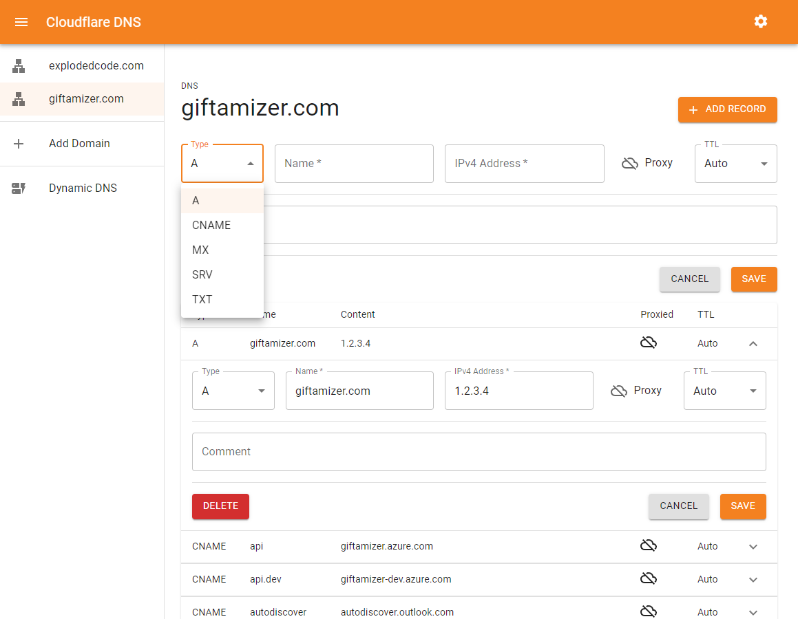
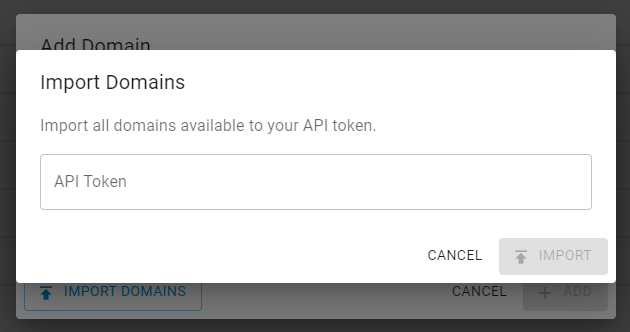
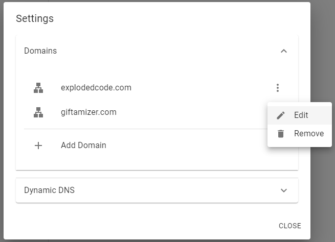
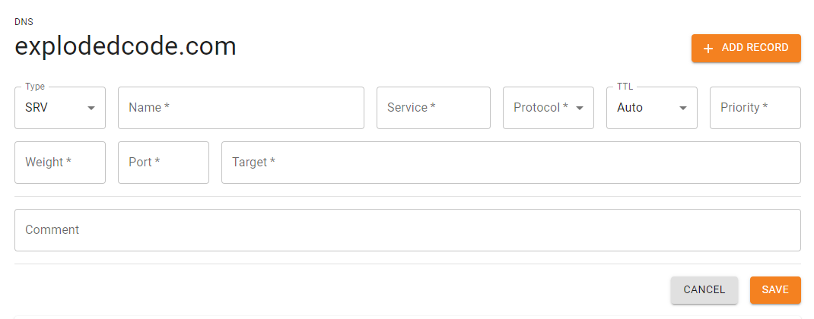
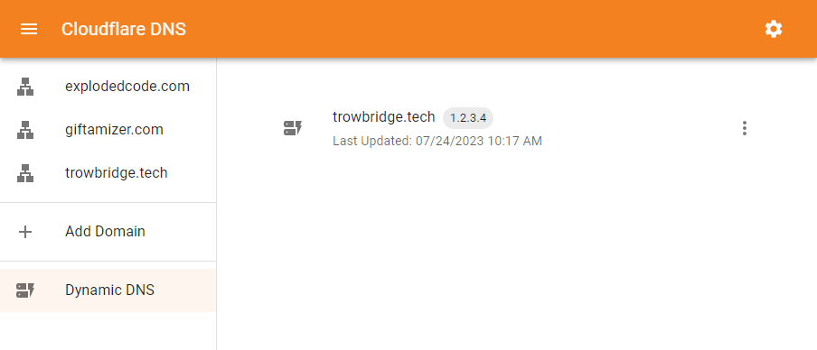

# Cloudflare DNS Manager

A web-based tool for managing DNS records using the [Cloudflare API](https://developers.cloudflare.com/api).



---

## Features

- **Import & Manage Domain Zones**  
    
  <br/>
  

- **Manage DNS Records**  
  

- **Dynamic DNS (DDNS)**  
  Automatically update DNS records when your public IP changes or on a schedule.  
  

---

## Supported DNS Record Types

- `A`
- `AAAA`
- `CNAME`
- `MX`
- `SRV`
- `TXT`

---

## Quick Start (Docker)

```bash
docker run -d \
    -p 8080:8080 \
    --name=cloudflare-dns \
    -e PUBLIC_IP_POLL_RATE_SEC=90 \
    evantrow/cloudflare-dns:latest
```

### Environment Variables

| Variable                | Description                                                                                                 |
|-------------------------|-------------------------------------------------------------------------------------------------------------|
| `PUBLIC_IP_POLL_RATE_SEC` | Interval (in seconds) to poll public IP for DDNS updates. Uses [ip-monitor](https://github.com/J-Chaniotis/ip-monitor). |

---

## Security

API tokens are securely stored in a SQLite database at `/db/database.sqlite`.  
**Important:** Ensure appropriate file permissions are set to protect sensitive data.

---

## License

MIT License. See [LICENSE](./LICENSE) for details.
